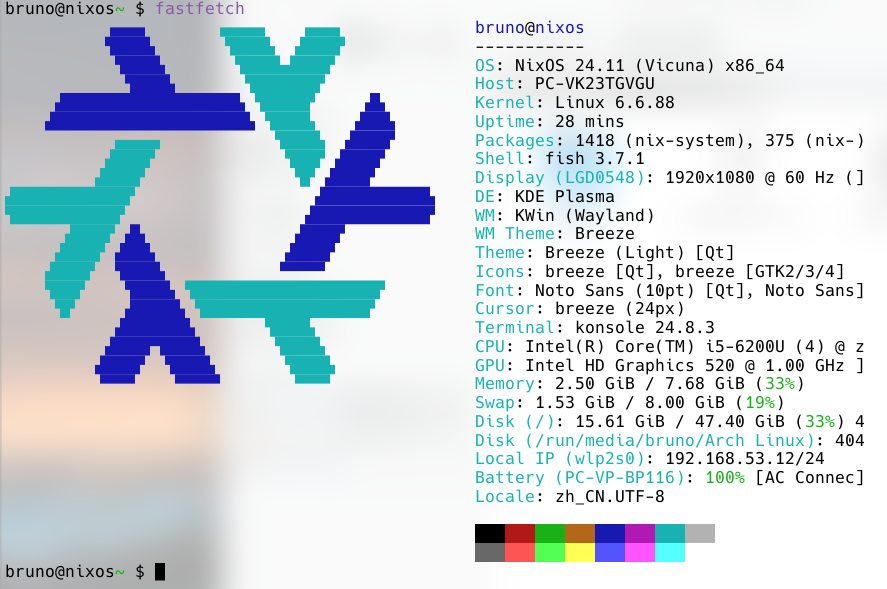

# nixos-config
这是来自一位新学会git工具的，刚刚配置好nixos中文输入法的nixos新手写的文档。

目前我只在自己的很烂的轻薄本上做了配置，因为我的游戏本是nvidia的显卡，我暂时不太想折腾nixos的nvidia显卡配置，即使我觉着nix很强大，但我暂时也只想在自己的轻薄本上做试验... 

轻薄本的config `/ultrabook/configuration.nix`

游戏本的config `/gamingbook/configuration` (待开发中，现在文件夹里边的还是轻薄本的config)

轻薄本配置：

